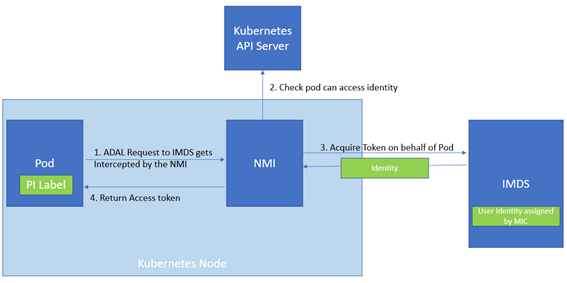

# Pod Identity best practice : Checking NMI Health

[TL/DR](#conclusion)

## Introduction

The [pod identity](https://github.com/Azure/aad-pod-identity) implementation for Azure Kubernetes Service (AKS) enables an easy way to authenticate against Azure resource without the need to manage connection string and secrets in your deployments. Additionally it enables to associate identities at pod level granularity. It relies on two components to work properly: 
* The Node Managed Identity [*NMI*] deployed on every node on the cluster (as a daemonset) component on the Kubernetes cluster that intercepts managed identity access token requests from pods normally directed to the VM IMDS endpoint. The NMI act like a proxy, verifying the request and forwarding allowed requests to the [Instance Metadata Service](https://docs.microsoft.com/en-us/azure/virtual-machines/linux/instance-metadata-service) (IMDS) on behalf on the pod.
* The Managed Identity Controller [*MIC*] watch the Kubernetes API server to dynamically mount identity on the underlying VMs, so that the *IMDS* can authenticate with this identity against Azure Active Directory. 
[More information](https://azure.github.io/aad-pod-identity/docs/).

Pod identity enables identities to be assigned and unassigned during the initial authentication request at a pod level granularity. The NMI is playing as a gatekeeper by intercepting the request to the IMDS and -if the pod has the correct identity- issue token requests on behalf of the calling pod to the IMDS. (see picture below)



Here a simplified stream: As the NMI act as a gatekeeper, it will check for the pod’s label to ensure that the correct authorization is present, otherwise the NMI will return a 404 to the requesting pod. (image below)


This is where lies the value of Pod Identity: The ability to assign identity at pod level and assign it at deployment time with labels.

## Problem statement

The *NMI* component is key as it is the one doing the gatekeeper to assign the pod to a given identity. It is important to understand NMI intercept the MSAL (Microsoft Authentication Library) directed to the *IMDS* endpoint by changing the iptables to reroute auth requests. Therefore, if for some reason the NMI is healthy, the running pods will issue requests directly to the IMDS. 

We have seen cases when application pods were available and the NMI wwas not during events like cluster creation, machine scale up or scale down. This could happen as Kubernetes does not have any native mechanisms to ensure running workloads before another one, therefore it can happen the application initiates authentication requests before the NMI is ready.

What would happen in such situation widely depends on:
* How many user managed identities do you have assigned in your cluster?
* Do you have a system assigned identity in your cluster?
* Are you using the *DefaultAzureIdentity* class (see NOTE) with no identity argument and letting pod identity match the default identity? 

---
> Azure SDKs provide nice way to easily authenticate against Azure ressources using Managed identity (in C#, python, node, java). It is considered as [best practice](https://devblogs.microsoft.com/azure-sdk/best-practices-for-using-azure-sdk-with-asp-net-core/) to use in your code the *DefaultAzureCredential* class to get authorization for your application as it enables seamless transition between development and production setup. This class tries different authentication mechanism in sequence and one of them is the managed identity.
---

If there is only one identity assigned to the underlying machines, the IMDS will match the request to this default identity. In this case, even without the NMI the application pod will to continue working without any error. However, the NMI Authorization checks is going to be completely bypassed.

Things become more complicated if there are multipe identities assigned to your cluster machines and don't specify the exact identity object Id in the identity request (using the *defaultAzureCredential* without providing arguments). First, there is a system assigned identity to your cluster, the IMDS will always default to this identity whatever are the other user-assigned managed identities assigned on the nodes. (Picture below)


If you only have user assigned identities, the IMDS won't know which one to impersonate will return a 400 error (mapped to *CredentialUnavailableException* in C#). As the [documentation states](https://docs.microsoft.com/en-us/azure/active-directory/managed-identities-azure-resources/how-to-use-vm-token#get-a-token-using-http), if there are multiple user assigned identities on the cluster `object_id`, `client_id` or `mi_res_id` needs to be specified in the request. (Picture below)


### Solutions

There are two way to solve the above problem:
* We could specify the *objectId* or *principalId* in the authorization request to explicitely ask for a specific identity from code. However, that would require knowing passing this information at application deployment time, for example passing an environment variable from the Kubernetes yaml. However, such strategy would compromise the decoupling between the application code and the identities id enabled by Pod Identity. In addition to map the identities in the CRDs for pod identity (usually at infrastructure deployment time), we would also need to pass identities id in our application deployment. We are therefore not keen on this solution.
* We could ensure that our application Pods run **only** when the NMI is ready to intercept requests to the IMDS. In that scenario, we fully rely on Pod identity to handle access token and couple our application lifetime to the NMI. Based on what we saw above, we believe this is how Pod identity should be operated. we investigated different solutions and will suggest different ways to achieve that. We investigated a diverse set of possible solution and we will discuss pros and cons here below. 

We followed two different potential way to deal with the issue:
* **Run application pod only when the NMI is healthy** by ensuring the NMI is alive and listening. A downside of this approach is that it would not prevent issues with pod identity that are not dependant on the NMI but on other components (e.g. a missconfiguration on the identity present in the cluster, Azure managed identity being part of a deleted resource group,... ). 
* In order to detect problems not directly caused by the NMI, we investigated ways to check the **full Azure identity stack** by requesting an access token to the IMDS. This method is more costly than the previous, as it involves extra cluster components to work. Additionally, as we are typically issuing auth requests, it could happen than NMI is unhealthy and it goes directly to IMDS. That would result in the behavior [described previously](#problem-statement). **Therefore, we would not recommend these solutions**. However, it contains interresting findings and enables to experience the claims made above therefore we kept it for reference. 

We also experimented different options on where to place these health checks:
* In an **init container**, checking during pod startup that the identity is working. We can use an init container to ensure our application pod only start if the NMI or the full identity stack is ready to receive the request. This solution generates less requests as the following ones as they occur at startup only. An obvious downside is that we do not get any runtime health assement detection. Therefore, it would not prevent error caused by the NMI being decommissioned before the application pod during cluster scale down events.
* In application's pod **health probes** continuously checking for the identity stack health and stop traffic to the application in case of problem. Unlike the init container, [health probes](https://kubernetes.io/docs/tasks/configure-pod-container/configure-liveness-readiness-startup-probes/) can offer runtime health verification at the cost of having those request fired as part of the pod runtime. Readiness probes decides if an application pod can receive HTTP traffic, whereas Liveness probes assess if a pod is in a bad state and should be restarted. A combination of both is typically recommended.
* In the **application code**. Using some language primitives, we can report health of a pod as an endpoint checked by the pod's health probe as the previous method. It enables much more health check than direct health probe programming. **This is the preferred method for any productive application** that would typically depend on >1 multiple external component.

## Assessing NMI health

As described earlier, we can decide to fully rely on the NMI being there to carry our pod identity checks. One easy way to do it is to check the NMI health probe are alive. As per the [pod identity probes code](https://github.com/Azure/aad-pod-identity/blob/master/pkg/probes/probes.go#L9), the NMI is healthy if the response has a 200 response code and the response payload is *Active* indicating that the NMI changed the *IPTable* routing and is ready to intercept requests made to IMDS as described [here](https://github.com/Azure/aad-pod-identity/issues/739)).

### Check NMI health with an init Container

We could perform a check as part of an init container to prevent a pod to start before the NMI iptables route have been set.

``` yaml
spec:
  initContainers:
  - name: init-myservice
    image: busybox:1.28
    env:
    - name: HOST_IP
      valueFrom:
        fieldRef:
          apiVersion: v1
          fieldPath: status.hostIP  
    command:
    - 'sh'
    - '-c'
    - "until wget -qO- $HOST_IP:8085/healthz; do echo waiting for NMI probe startup; sleep 2; done"
  containers:
  - name: <Your name>
    image: <your application image>
```
NB. the example above is with wget, the test yaml with curl, both approaches work and we keep different as reference.

This solution is tested in our automated tests, please find the associated [yaml](cmd/fixtures/nmiHealthCheckInInitContainer.yaml) and the [test code](cmd/nmi_health_integration_test.go).

This is a good solution, but it does not offer any runtime protection therefore we would rather suggest to look at the next option.

### Check NMI health with a Health Probe

To make up with the shortcomings of the previous solution, we could perform in a liveness check in our application pod's health probes.

``` yaml
spec:
  containers:
  - name: <Your name>
    image: <your application image>
    env:
    - name: HOST_IP
      valueFrom:
        fieldRef:
          apiVersion: v1
          fieldPath: status.hostIP  
    readinessProbe:
      exec:
        command:
        - sh
        - -c
        - wget -qO- $HOST_IP:8085/healthz
      initialDelaySeconds: 0
      periodSeconds: 5
    livenessProbe:
      exec:
        command:
        - sh
        - -c
        - wget -qO- $HOST_IP:8085/healthz
      initialDelaySeconds: 30
      periodSeconds: 5
      failureThreshold: 5
```

Note that we are here using a conjunction of liveness and readiness probe. Depending on your application we advice an aggressive readiness probe to avoid directing http traffic to non-healthy pods but a more conservative liveness probe to avoid unessecary pod restarts. Such setup would ensure maximum reactivity while avoiding unessacery reaction to transient unavailbilities. You can see such example of probes configuration in the example above. These settings are a suggestion, and one should adapt them with the behaviour of the applications. Also some external requirements might have their own set of best practices and recommendations. 

This solution is tested in our automated tests, please find the associated [yaml](cmd/fixtures/nmiHealthCheckInProbes.yaml) and the [test code](cmd/nmi_health_integration_test.go)

### Check NMI Health from code

When the application grows and the application depend on multiple other components to perform normally, the method described above is not sufficient. In that case, it is advised tu use application primitives to construct an health application endpoint, aggregating multiple components' and application parts' helath into a single endpoint. This endpoint would then be checked by the health probe. The YAML look similarly as above.

``` yaml
spec:
  containers:
  - name: <your container name>
    image: <your application image name>
    readinessProbe:
      httpGet:
        path: /api/healthz
        port: 80
      initialDelaySeconds: 0
      periodSeconds: 5
    livenessProbe:
      httpGet:
        path: /api/healthz
        port: 80
      initialDelaySeconds: 30
      periodSeconds: 5
      failureThreshold: 5
```

You can find a full asp.net core example under [this folder](/NMIHealthChecks). The can be done in other languages using the health checks primitives.
NB. Separating the liveness and readiness check in code would be better in case of a real deployment.

This solution is tested in our automated tests, please find the associated [yaml](cmd/fixtures/nmiHealthCheckInProbes.yaml) and the [test code](cmd/nmi_health_integration_test.go)

## Assessing health of the full identity stack

In the methods described above, we were tying our application lifetime to the NMI component to ensure the identity mediation was performed by the pod identity. We could still get exception external to pod identity, such as if an [identity is not yet assigned on a physical machine](https://azure.github.io/aad-pod-identity/docs/best-practices/#retry-on-token-retrieval) or if someone accidentaly delete a user assigned identity on Azure.

We are listing this section here as reference and **we advice people to generally prefer the NMI health checks**. The checks made here are much more costly than the previous, therefore unlike previously, **we prefer init containers**. Additionally they depend on the cluster configuration: Do you have more than one user assigned identity on the cluster? Do you have a system assigned identity assigned on the cluster? Please refer to the [introduction](#introduction) for more details.

### Assess health of the full identity stack by an init container getting and Azure access token

**Listed as reference and not recommended**

We can condition the start of our application container with the fact that the application can make a successfull access token request to the IMDS. 

``` yaml
spec:
  initContainers:
  - name: init-myservice
    image: curlimages/curl:1.28
    command:
    - 'sh'
    - '-c'
    - "until curl 'http://169.254.169.254/metadata/identity/oauth2/token?api-version=2018-02-01&resource=https://management.azure.com/' -H Metadata:true --fail -s; do echo waiting for NMI probe startup; sleep 2; done"
  containers:
  - name: <Your name>
    image: <your application image>
```

if you want to use this strategy in production, **we strongly advice to change the command to also decode the access token and check that the identity object id matches with the expected identity**. Otherwise your request might return a different identites (e.g. the machines' system-assigned identity), or face some IMDS caching issue, for example as [this one if identity gets recreated](https://github.com/Azure/aad-pod-identity/issues/681).

This solution is tested in our automated tests, please find the associated [yaml](cmd/fixtures/identityCheckInInitContainer.yaml) and the [test code](cmd/nmi_health_integration_test.go)


### Assess health of the full identity stack by an init container and az cli
Using an az cli call from an init container to check the full identity stack health is the strategy officially [recommended by the Pod Identity team](https://azure.github.io/aad-pod-identity/docs/best-practices/#retry-on-token-retrieval)

``` yaml
spec:
  initContainers:
  - name: init-myservice
    image: mcr.microsoft.com/azure-cli
    command:
    - sh
    - -c
    - az login --identity --debug
  containers:
  - name: <Your name>
    image: <your application image>
```

It works very well and test a full roundtrip to azure -not just token allocation-. This is much more costly than just getting the token as there are requests made to the Azure cloud. Additionaly the docker image used for the init container is `mcr.microsoft.com/azure-cli` which is 712 mb. This is a very heavy container compared with the one we use for wget (busybox ~1.5 mb) or curl (curlimages/curl ~15 mb). One should consider that higher microservice footprint might impact pod startup time and general agility on the cluster and consider this method carefully.

This solution is tested in our automated tests, please find the associated [yaml](cmd/fixtures/identityCheckInInitContainer.yaml) and the [test code](cmd/identity_health_integration_test.go)

### Assess health of the full identity stack by an application health check

**Listed as reference and not recommended**
The Az Cli check above can't be performed as liveness probe as the command line seems to cache the access (even when doing an az logout). Therefore here we continue the investigation by getting the access token in the health probes.

``` yaml
spec:
  containers:
  - name: <your container name>
    image: <your application image name>
    readinessProbe:
      exec:
        command:
        - sh
        - -c
        - curl 'http://169.254.169.254/metadata/identity/oauth2/token?api-version=2018-02-01&resource=https://management.azure.com/' -H Metadata:true -s --fail'
      initialDelaySeconds: 0
      periodSeconds: 5
    livenessProbe:
      exec:
        command:
        - sh
        - -c
        - curl 'http://169.254.169.254/metadata/identity/oauth2/token?api-version=2018-02-01&resource=https://management.azure.com/' -H Metadata:true -s --fail'
      initialDelaySeconds: 30
      periodSeconds: 5
      failureThreshold: 5
```

if you want to use this strategy in production, **we strongly advice to change the command to also decode the access token and check that the identity object id matches with the expected identity**. Otherwise your request might return a different identites (e.g. the machines' system-assigned identity), or face some IMDS caching issue, for example as [this one if identity gets recreated](https://github.com/Azure/aad-pod-identity/issues/681).

This solution is tested in our automated tests, please find the associated [yaml](cmd/fixtures/identityAzBestPracticesCheckInInitContainer.yaml) and the [test code](cmd/identity_health_integration_test.go)


### Assess health of the full identity in the application code

**Listed as reference and not recommended**

In case of complex situation where the application container rely on multiple external dependencies, it is advised to add the NMI/Identity Stack health check as part of the application code along to other health checks. 

Let us start by assessing the state of the NMI health. Note that to access the NMI ip from the code, we need the the Host IP from Kubernetes to pod's environment variable in the pod's yaml. Here is the yaml doing that:

``` yaml
spec:
  containers:
  - name: <your container name>
    image: <your application image name>
    env:
    - name: HOST_IP
      valueFrom:
        fieldRef:
          apiVersion: v1
          fieldPath: status.hostIP
    readinessProbe:
      httpGet:
        path: /api/healthz
        port: 80
      initialDelaySeconds: 0
      periodSeconds: 5
    livenessProbe:
      httpGet:
        path: /api/healthz
        port: 80
      initialDelaySeconds: 30
      periodSeconds: 5
      failureThreshold: 5
```

if you want to use this strategy in production, **we strongly advice to change the command to also decode the access token and check that the identity object id matches with the expected identity**. Otherwise your request might return a different identites (e.g. the machines' system-assigned identity), or face some IMDS caching issue, for example as [this one if identity gets recreated](https://github.com/Azure/aad-pod-identity/issues/681).

You can find [here](/IdentityHealthChecks) an asp.net core application example that configures the readiness and liveness probe. The same idea could be reimplemented using the health checks primitives of other languages.
NB. Separating the liveness and readiness check in code would be better in case of a real deployment.

This solution is tested in our automated tests, please find the associated [yaml](cmd/fixtures/identityHealthCheckInCode.yaml) and the [test code](cmd/identity_health_integration_test.go)

## Validation
The different approached have been validated using automated tests that you can replicate. 
The experiments are split in two sections as the rest of the document
* Tests on [NMI strategies](cmd/nmi_health_integration_test.go).
* Tests on [full identity strategies](cmd/identity_health_integration_test.go). 

Due to the sheer complexity and size of the tests, the full set of test takes approximately 30 minute to complete, we would advice to run them one by one. 

### Running the tests
1. Make sure your local kubectl context points to the cluster where you want the tests to run
2. Make sure Golang is installed and ready to run
3. [Install and configure pod identity](https://azure.github.io/aad-pod-identity/docs/demo/standard_walkthrough) at least once on your cluster
4. The identity tests are configured to run with 2 user assigned identities on the cluster and no system assigned identites. Make sure to manually assign a second user assigned identity to your AKS' VMSS. (You can also play with these tests to see the different behavior when different identities are available in the cluster).
5. Run the tests one by one. (running the full set can take up to 50m)


### Test cases

We check for the following:
* [Happy case] Does the pod correctly starts if everything is set up and in place. (done as part of the runtime check)
* [Startup Check] Is the pod prevented to start if the NMI is not in place at pod startup (in case of health prove, ensure the pod is never in ready state)?
* [Runtime Check] Can the probes prevent traffic and terminate the pod if the NMI stop being responsive?
* [Pod Identity Check] Does this method detect other problems related to pod identity (like in that case, the Azure Identity missing)

For the identity checks we also add the following tests. As part of these tests we deploy two containers on the cluster, one with the identity labels (to make sure the identity is assigned on the VMSS, one without labels)
* [Can pod without label access identity when NMI is up?]
* [Can pod without label access identity when NMI is down?]
As described in the [introduction](#introduction), these tests are complex and rely on a cluster state. They are configured to work if two or more user assigned identities are assigned on the cluster. If you deviate from this settings (have only one user assigned identity or have a system assigned identity set) you will see the test  [Can pod without label access identity when NMI is down?] as the IMDS will be able to resolve token to a the default identity (the system assigned or the unique user assigned identity). 

## Conclusion

As often, there are different ways to deal with the problem with each suggested approach having advantages and disadvantages.

Please find here below a recapitulative of what we discussed above:

|  | Container is prevented to start if NMI is not ready | Container is terminated if NMI stops working | Container is terminated if other parts of pod identity are not working |
|-|-|-|-|
| NMI health check as init container | Yes | No | No |
| NMI health check as health probes | Yes | Yes | No |
| Custom health probe check on NMI health probes | Yes | Yes | No |
| Full identity check as init container | Yes | No | No |
| Full identity check as health probes | Yes | Yes | Yes |
| Full identity check as custom health check | Yes | Yes | Yes |

We recommend relying on its health to handle the access token part. Becauseas we seen earlier Identity checks might work even if the NMI is not active, generating undesired behaviors on your custer.

The preferred strategies is the NMI Health check in code 
If you have a very simple code base that don't have any other health check, you could also consider the NMI Health Checks in application's pod health check.

